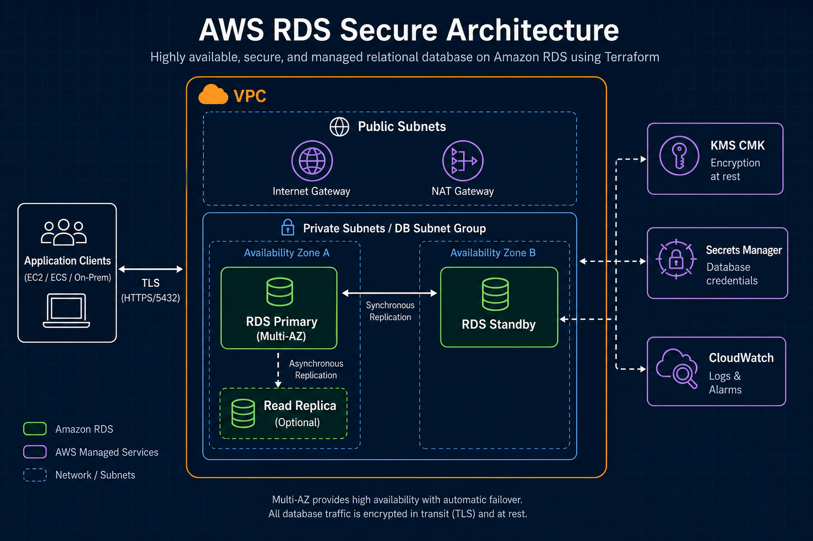
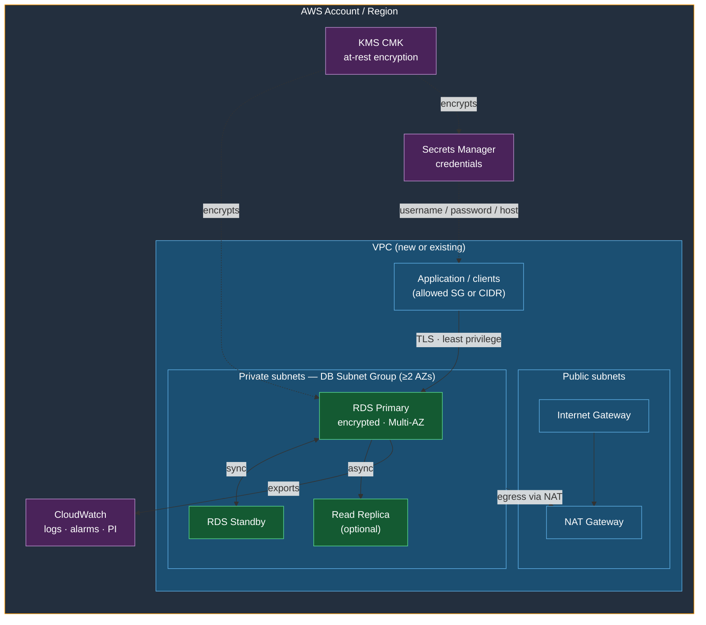

# ☁️ AWS RDS Terraform — Secure, Multi-AZ, Production-Ready Template
Terraform template to deploy **Amazon RDS** (PostgreSQL, MySQL, or MariaDB) following AWS best practices for **security**, **high availability**, **disaster recovery**, and **performance**.

All documentation, usage guidance, and examples live in this README. The `.tf` files contain code only.

## 🏗️ Architecture



| Layer | What you get |
|-------|----------------|
| **Network** | Private subnets only for RDS; optional NAT for outbound |
| **Database** | Multi-AZ primary/standby + optional read replica |
| **Security** | KMS encryption, Secrets Manager, restrictive SG, TLS |
| **Observability** | CloudWatch logs, alarms, Performance Insights |

<details>
<summary>Mermaid version (editable / GitHub fallback)</summary>



</details>

## 📁 Repository structure
```
.
├── main.tf                      # Module orchestration
├── variables.tf                 # Variables (types, defaults, validations)
├── outputs.tf                   # Outputs
├── locals.tf                    # Ports, recommended versions, tags
├── providers.tf                 # AWS provider + default tags
├── versions.tf                  # Terraform / provider versions
├── terraform.tfvars.example     # Sample values (copy to terraform.tfvars)
├── README.md                    # This documentation
└── modules/
    ├── networking/              # VPC, private subnets (2+ AZs), NAT, DB subnet group
    ├── kms/                     # CMK with rotation for RDS, Secrets, and Performance Insights
    ├── security/                # Security Group (least privilege) + Enhanced Monitoring role
    ├── secrets/                 # random_password + Secrets Manager container
    └── rds/                     # Instance, parameter/option groups, replicas, alarms
```

### 🧩 Module responsibilities
| Module | Purpose |
|--------|---------|
| `networking` | Creates a VPC with DNS, private subnets (RDS), optional public subnets + NAT/IGW, and a DB Subnet Group across ≥2 AZs. RDS is never placed in public subnets. |
| `kms` | CMK with key rotation; policy for account root, RDS, Secrets Manager, and CloudWatch Logs. |
| `security` | SG with ingress only from allowed CIDRs/SGs and egress limited to the VPC; Enhanced Monitoring IAM role. |
| `secrets` | Generates a strong password and creates the secret; the version with `host` is written from `main.tf` after RDS is created. |
| `rds` | Encrypted Multi-AZ instance, engine-specific secure parameter groups, option group (MySQL/MariaDB), read replicas, and CloudWatch alarms. |

### 🔑 Credentials flow
1. The `secrets` module generates the password (`random_password`).
2. RDS is created with that password (or with `manage_master_user_password = true` using the RDS-managed secret).
3. After deploy, `main.tf` publishes a JSON secret to Secrets Manager with `username`, `password`, `host`, `port`, `dbname`, etc.
4. **Never** hardcode passwords in code or in versioned `terraform.tfvars`.

### 📌 Important locals (`locals.tf`)
- Default recommended versions: PostgreSQL `16.4`, MySQL `8.0.39`, MariaDB `10.11.9`.
- Default ports: 5432 (postgres), 3306 (mysql/mariadb).
- Parameter group families: `postgres16`, `mysql8.0`, `mariadb10.11`.
- Common tags (only): `project_name` and `environment`.

> **Engine versions change over time.** AWS regularly releases new RDS engine versions and eventually retires older ones. Treat the values in `locals.tf` as sensible defaults, not a permanent source of truth. Before every deploy (especially to staging/prod), check the [RDS engine version docs](https://docs.aws.amazon.com/AmazonRDS/latest/UserGuide/CHAP_RDS_Engine.html) / console for versions available in your region, and pin `engine_version` (and matching `parameter_group_family`) in `terraform.tfvars` when you need a fixed, reproducible version.

### 🌐 Default network access
If you do not set `allowed_cidr_blocks` or `allowed_security_group_ids`, the VPC CIDR is allowed. In production, prefer restricting access via the application Security Group.

## ✨ Features
### 🔒 Security
| Capability | Implementation |
|------------|----------------|
| Encryption at rest | KMS CMK (created or existing) |
| Encryption in transit | PostgreSQL: `rds.force_ssl=1`; MySQL/MariaDB: `require_secure_transport=1` |
| Network | Private subnets, `publicly_accessible = false` |
| Access | Least-privilege Security Groups |
| Authentication | IAM Database Authentication + `rds-db:connect` policy |
| Credentials | Secrets Manager (never hardcoded) |
| Auditing | CloudWatch log exports (see engine section below) |
| Deletion | `deletion_protection` + final snapshot |

### ⚙️ Parameter groups and logs by engine
**PostgreSQL:** `rds.force_ssl`, `log_connections`, `log_disconnections`, `log_statement=ddl`, `log_min_duration_statement=1000` (slow queries >1s), `shared_preload_libraries=pg_stat_statements`. CloudWatch logs: `postgresql`, `upgrade`. You can add `pgaudit` via additional parameters on the RDS module.

**MySQL / MariaDB:** `require_secure_transport`, `slow_query_log`, `long_query_time`, `general_log`, `log_output=FILE`. Logs: `error`, `general`, `slowquery` (+ `audit` on MariaDB). MariaDB includes an option group with `MARIADB_AUDIT_PLUGIN`.

### 🛡️ High availability and DR
- Multi-AZ
- Automated backups (retention ≥ 7 days, configurable up to 35)
- Backup window (`03:00-04:00` UTC) and maintenance window (`sun:04:00-sun:05:00` UTC)
- Enhanced Monitoring + Performance Insights (encrypted with the same CMK)
- Auto minor version upgrade (configurable)
- Copy tags to snapshots
- Optional read replicas (with `ReplicaLag` alarm)

### 🚀 Performance
- Parametrizable instance class
- Storage autoscaling (`max_allocated_storage`)
- gp3 / io1 / io2 with optional IOPS
- CloudWatch alarms: CPU, free storage, connections, freeable memory (`FreeableMemory` < 256 MiB), replica lag

## ✅ Prerequisites
1. [Terraform](https://www.terraform.io/downloads) ≥ 1.5
2. AWS credentials configured (`aws configure` or environment variables)
3. Sufficient IAM permissions (RDS, EC2/VPC, KMS, Secrets Manager, IAM, CloudWatch)

## ▶️ Quick start
```bash
cd Aws.RDS.Terraform
cp terraform.tfvars.example terraform.tfvars
# Edit terraform.tfvars
terraform init
terraform plan
terraform apply
```

Get connection details:

```bash
terraform output db_instance_endpoint
terraform output -raw secrets_manager_secret_arn

aws secretsmanager get-secret-value \
  --secret-id "$(terraform output -raw secrets_manager_secret_arn)" \
  --query SecretString --output text | jq .
```

## 📦 Remote backend (recommended for production)
Add an S3 + DynamoDB backend for state and locks in `versions.tf` (or a `backend.tf`):

```hcl
terraform {
  backend "s3" {
    bucket         = "my-terraform-state-bucket"
    key            = "rds/terraform.tfstate"
    region         = "eu-west-1"
    encrypt        = true
    dynamodb_table = "terraform-locks"
  }
}
```

## 🗄️ Choosing the database engine
Set `engine` in `terraform.tfvars`. Supported values today:

| `engine` | Default port | Default version (`locals.tf`) | Parameter family | Notes |
|----------|--------------|-------------------------------|------------------|-------|
| `postgres` | 5432 | `16.4` | `postgres16` | Default engine |
| `mysql` | 3306 | `8.0.39` | `mysql8.0` | Option group created |
| `mariadb` | 3306 | `10.11.9` | `mariadb10.11` | Option group + audit plugin |

> ⚠️ **Review versions before you apply.** Defaults in `locals.tf` are updated only when someone maintains this template. AWS keeps shipping and retiring RDS engine versions; a version that worked last quarter may no longer be available in your region. Always verify the target version in the AWS console or docs before deploying, and prefer pinning `engine_version` in `terraform.tfvars` for production.

**Not supported:** Microsoft SQL Server (`sqlserver-*` engines). This template only covers PostgreSQL, MySQL, and MariaDB. Adding SQL Server would require different licensing, ports (1433), parameter/option groups, and CloudWatch log types.

### 🛠️ How to configure each engine
1. Copy the example file: `cp terraform.tfvars.example terraform.tfvars`
2. Set `engine` (and optionally `engine_version`, `db_name`, `db_username`, `db_port`).
3. Run `terraform init && terraform plan && terraform apply`.

If you omit `engine_version` or `parameter_group_family`, values from `locals.tf` are used. Override them when you need a specific RDS version:

```hcl
engine                 = "mysql"
engine_version         = "8.0.39"
parameter_group_family = "mysql8.0"
db_port                = 3306   # optional; defaults from locals
```

### 🐘 PostgreSQL
```hcl
aws_region   = "eu-west-1"
project_name = "my-app"
environment  = "dev"

engine      = "postgres"
# engine_version = "16.4"          # optional
# db_port        = 5432            # optional
db_name     = "appdb"
db_username = "dbadmin"

instance_class        = "db.t4g.medium"
allocated_storage     = 100
max_allocated_storage = 500
multi_az              = true
deletion_protection   = true
skip_final_snapshot   = false
```

### 🐬 MySQL
```hcl
aws_region   = "eu-west-1"
project_name = "my-app"
environment  = "dev"

engine      = "mysql"
# engine_version = "8.0.39"        # optional
# db_port        = 3306            # optional
db_name     = "appdb"
db_username = "dbadmin"

instance_class        = "db.t4g.medium"
allocated_storage     = 100
max_allocated_storage = 500
multi_az              = true
deletion_protection   = true
skip_final_snapshot   = false
```

### 🦭 MariaDB
```hcl
aws_region   = "eu-west-1"
project_name = "my-app"
environment  = "dev"

engine      = "mariadb"
# engine_version = "10.11.9"       # optional
# db_port        = 3306            # optional
db_name     = "appdb"
db_username = "dbadmin"

instance_class        = "db.t4g.medium"
allocated_storage     = 100
max_allocated_storage = 500
multi_az              = true
deletion_protection   = true
skip_final_snapshot   = false
```

## 💡 Other configuration examples
### 🕸️ Existing VPC
```hcl
create_vpc = false
vpc_id     = "vpc-0123456789abcdef0"
subnet_ids = ["subnet-aaa", "subnet-bbb"]  # at least 2 AZs

allowed_security_group_ids = ["sg-app-xxxxx"]
allowed_cidr_blocks        = []
```

### 🔐 Existing CMK
```hcl
create_kms_key = false
kms_key_arn    = "arn:aws:kms:eu-west-1:123456789012:key/xxxxxxxx-xxxx-xxxx-xxxx-xxxxxxxxxxxx"
```

### 📖 Read replicas + SNS alarms
```hcl
create_read_replica         = true
read_replica_count          = 1
read_replica_instance_class = "db.t4g.medium"

create_cloudwatch_alarms = true
alarm_sns_topic_arn      = "arn:aws:sns:eu-west-1:123456789012:rds-alerts"
```

### 💾 io2 storage with IOPS

```hcl
storage_type          = "io2"
allocated_storage     = 200
max_allocated_storage = 1000
iops                  = 10000
```

### 🔏 RDS-managed master password
```hcl
manage_master_user_password = true
```

In this mode the custom `secrets` module is not used; RDS creates and rotates the secret in Secrets Manager.

## 🎛️ Main variables
| Variable | Default | Description |
|----------|---------|-------------|
| `engine` | `postgres` | `postgres`, `mysql`, or `mariadb` |
| `instance_class` | `db.t4g.medium` | Instance class |
| `multi_az` | `true` | High availability |
| `backup_retention_period` | `7` | Days (min. 7) |
| `create_vpc` | `true` | Create a dedicated VPC |
| `create_kms_key` | `true` | Create a CMK |
| `deletion_protection` | `true` | Prevent accidental deletion |
| `iam_database_authentication_enabled` | `true` | IAM auth |
| `create_read_replica` | `false` | Read replicas |
| `manage_master_user_password` | `false` | RDS-managed secret |

Full list with types and validations: `variables.tf`.

## 📤 Main outputs
| Output | Description |
|--------|-------------|
| `db_instance_endpoint` | Host:port |
| `db_instance_arn` | Instance ARN |
| `db_instance_resource_id` | For `rds-db:connect` policies |
| `secrets_manager_secret_arn` | Credentials |
| `security_group_id` | RDS security group |
| `kms_key_arn` | Encryption CMK |
| `read_replica_endpoints` | Replica endpoints |
| `rds_iam_connect_policy_arn` | IAM connect policy |

## 🪪 IAM Database Authentication
1. In the database, create an IAM-mapped user (PostgreSQL example):

```sql
CREATE USER app_user WITH LOGIN;
GRANT rds_iam TO app_user;
```

2. Attach the generated policy (`rds_iam_connect_policy_arn`) to your application role.

3. Connect with an IAM token (valid ~15 minutes) instead of a password.

## 🔵🟢 Blue/Green deployments
For major version upgrades with minimal downtime, use Blue/Green (console, CLI, or AWS provider). Example:

```hcl
resource "aws_rds_blue_green_deployment" "example" {
  source                         = module.rds.db_instance_arn
  target_engine_version          = "17.2"
  target_db_parameter_group_name = "..."
}
```

Check the AWS provider docs for the exact resource and supported arguments in your version.

## 🔄 Lifecycle / operations
- `final_snapshot_identifier` uses a timestamp; the instance lifecycle ignores changes to that field to avoid recreations.
- If you rotate the password outside Terraform, you may need to ignore `password` in the `aws_db_instance` lifecycle or adopt `manage_master_user_password`.
- In critical environments you can add `prevent_destroy = true` to the instance lifecycle.

## 💣 Destruction
1. If `deletion_protection = true`, set it to `false` and apply.
2. Run `terraform destroy`.
3. With `skip_final_snapshot = false`, a final snapshot is created before deletion.

## 💰 Costs (indicative)
- Multi-AZ roughly doubles instance + storage cost
- NAT Gateway has a fixed cost + data charges if `enable_nat_gateway = true`
- Performance Insights and Enhanced Monitoring cost depend on retention
- gp3 is usually cheaper than io1/io2 for general workloads

## ☑️ Security checklist
- [x] RDS is not publicly accessible
- [x] Encryption at rest with KMS
- [x] SSL/TLS enforced via parameter group
- [x] Password stored in Secrets Manager
- [x] Deletion protection
- [x] Audit logs in CloudWatch
- [x] Restrictive Security Groups
- [x] Backups ≥ 7 days + Multi-AZ

## 📄 License
Internal use / infrastructure template. Adapt tags, regions, and engine versions to your organization.

## Created
By Agustina Fassina
